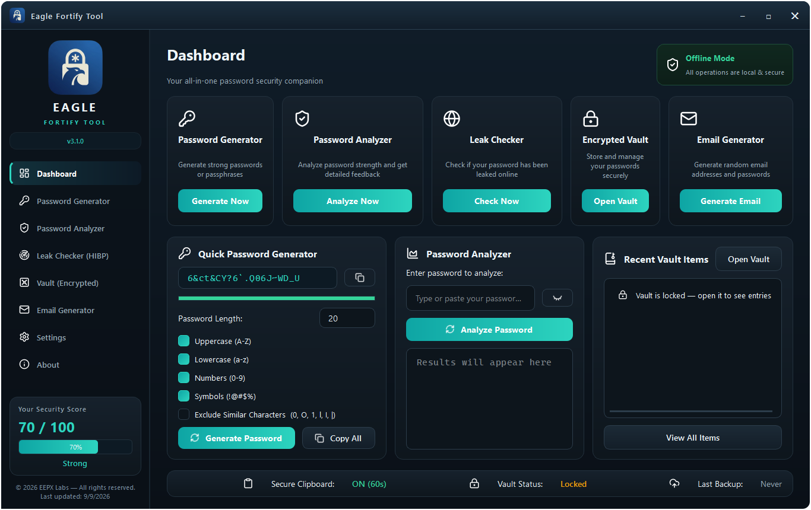
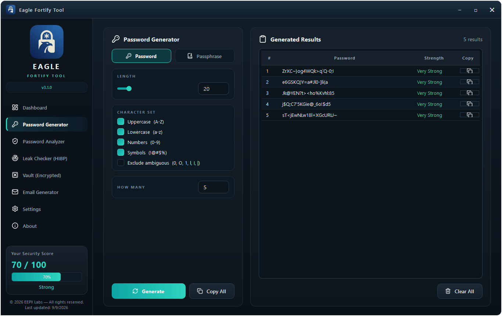
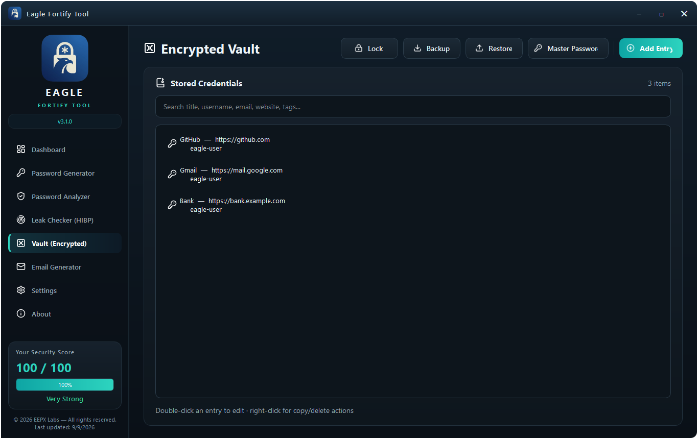
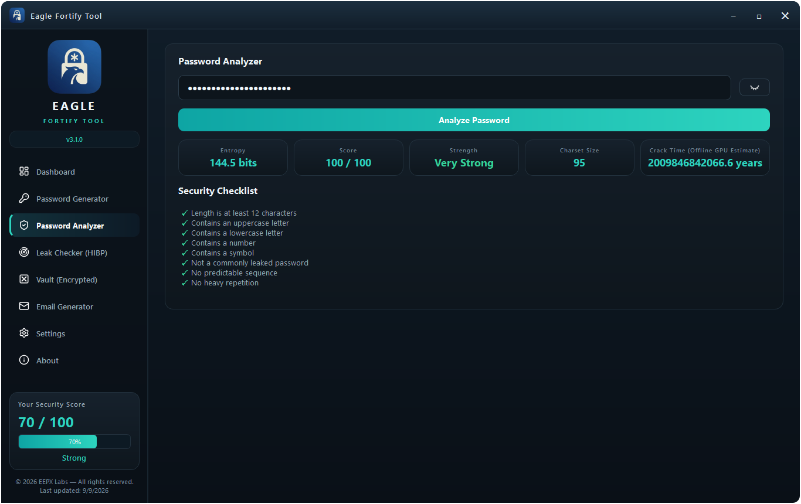
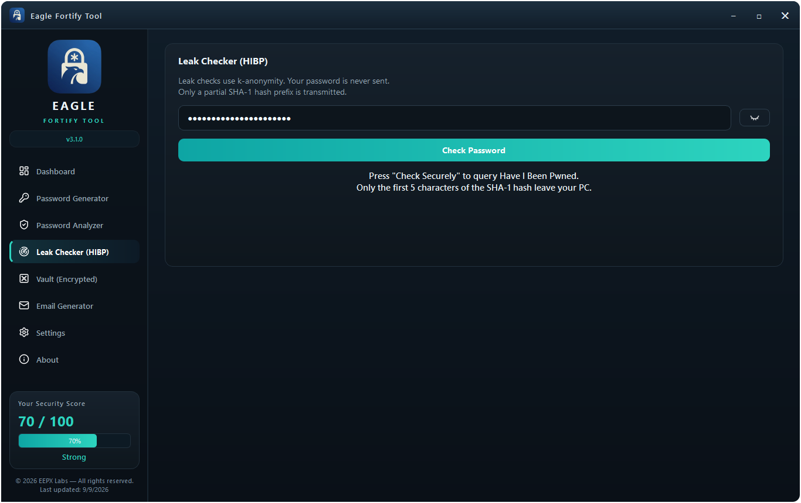
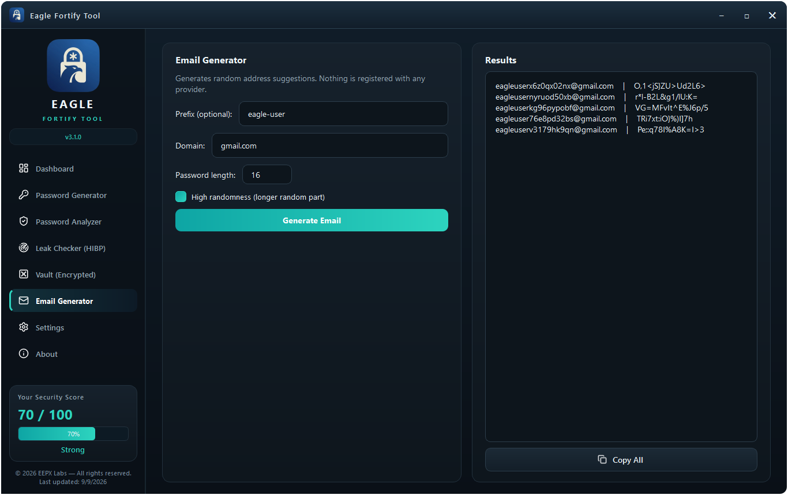

# Eagle Fortify Tool


Eagle Fortify Tool is a local password utility. It can generate strong
passwords, check how strong a password is, create secure passphrases and
email identities, and keep your credentials in a private encrypted vault.
Everything runs locally on your device - nothing is uploaded anywhere.

You get two ways to use it:

| What | How to open it |
| --- | --- |
| Desktop app | Start menu shortcut, desktop shortcut, or `EagleFortifyTool.exe` / `eagle-fortify-gui` |
| Command line tool | Type `eftool` in any Command Prompt |
| 📖 Visual user guide | **[docs/USER_GUIDE.md](docs/USER_GUIDE.md)** — screenshots + explanation of every feature |

---

## 📸 Feature tour

Full walkthrough with explanations: **[📖 Visual User Guide](docs/USER_GUIDE.md)**

| Dashboard | Password Generator | Encrypted Vault |
|---|---|---|
|  |  |  |

| Password Analyzer | Leak Checker | Email Generator |
|---|---|---|
|  |  |  |

---

## Install

### Option 1 - Windows Installer (recommended)

1. Run **`EagleFortifyTool-3.1.0-Setup.exe`**.
2. Click **Install**. The option **"Add eftool to PATH"** is already ticked by
   default, so the command line tool will work from every Command Prompt.
3. Open a **new** Command Prompt window.

### Option 2 - Portable version

1. Extract **`EagleFortifyTool-3.1.0-portable.zip`** to any folder (for
   example `C:\EagleFortify`).
2. Run **`EagleFortifyTool.exe`** to open the app.
3. To use `eftool` from any Command Prompt, add that folder to PATH:

   - Press **Win + R**, type `sysdm.cpl`, press Enter.
   - Advanced → **Environment Variables...**
   - Under **User variables**, select **Path** → **Edit...** → **New**.
   - Paste the folder you extracted the zip to (e.g. `C:\EagleFortify`) → **OK**.
   - Open a **new** Command Prompt.

### Verify the command line tool

Open any Command Prompt (new one, not one opened before installing) and type:

```
eftool --version
```

You should see `Eagle Fortify Tool 3.1.0`. If you see
"`'eftool' is not recognized...`", close the Command Prompt window, open a
new one, and try again.

---

## Using the command line tool

```
eftool --version                     Show the installed version
eftool generate                      Generate a strong password
eftool generate --length 24 --count 3   3 passwords, 24 characters each
eftool analyze "your-password-here"  Show how strong a password is
eftool passphrase                    Generate a secure passphrase
eftool passphrase --words 5          Passphrase with 5 words
eftool email                         Generate a random email identity
eftool vault create                  Create your encrypted vault
eftool vault list                    List what is stored in the vault
```

**Notes**

- All commands work offline.
- `eftool leak-check "password"` is the only command that uses the network. It
  checks whether a password appears in known data breaches. Only ever check
  passwords you no longer use.

## Opening the desktop app

From a Command Prompt:

```
eagle-fortify-gui
```

Or double-click:

- **EagleFortifyTool.exe** (portable version), or
- the **Eagle Fortify Tool** shortcut in the Start Menu or on the desktop
  (installer version).

---

## Where your data lives

- Vault file: `%USERPROFILE%\.eagle_fortify\main.efv`
- Settings: `%USERPROFILE%\.eagle_fortify\settings.json`

Backups you create are encrypted files too. Uninstalling the app does not
delete your vault.

## Privacy & zero-knowledge encryption

Eagle Fortify Tool is built around a local, zero-knowledge security model:

- **Fully local** - the vault, the password / passphrase / email generators
  and the strength analyzer all run on your own device; nothing is uploaded
  anywhere. The only network feature is the optional
  `eftool leak-check "..."` command, which sends just the first five
  characters of a SHA-1 hash (HIBP k-anonymity) - never the password itself.
- **Encrypted at rest** - vault entries are sealed with **AES-256-GCM**, and
  the encryption key is derived from your Master Password with
  **PBKDF2-HMAC-SHA256** (600,000 iterations, random 32-byte salt).
- **Zero knowledge** - EEPX Labs has no backdoor and no cloud sync. Your
  Master Password never leaves your machine and is stored nowhere, so a lost
  Master Password **cannot be recovered - not even by the developer** - and
  an encrypted vault cannot be decrypted without it. Backup files are
  encrypted vaults too.

Keep your Master Password safe. If it is lost, your vault data cannot be
recovered by anyone, including the developer.

## Uninstall

- **Installer version:** Windows Settings → Apps → **Eagle Fortify Tool** →
  **Uninstall**. If you also enabled "Add eftool to PATH", the installer
  removes it automatically.
- **Portable version:** delete the folder. If you manually added it to PATH,
  remove that PATH entry too.

---

## License

Proprietary - all rights reserved. See [LICENSE](LICENSE) for the terms and
conditions of use.
