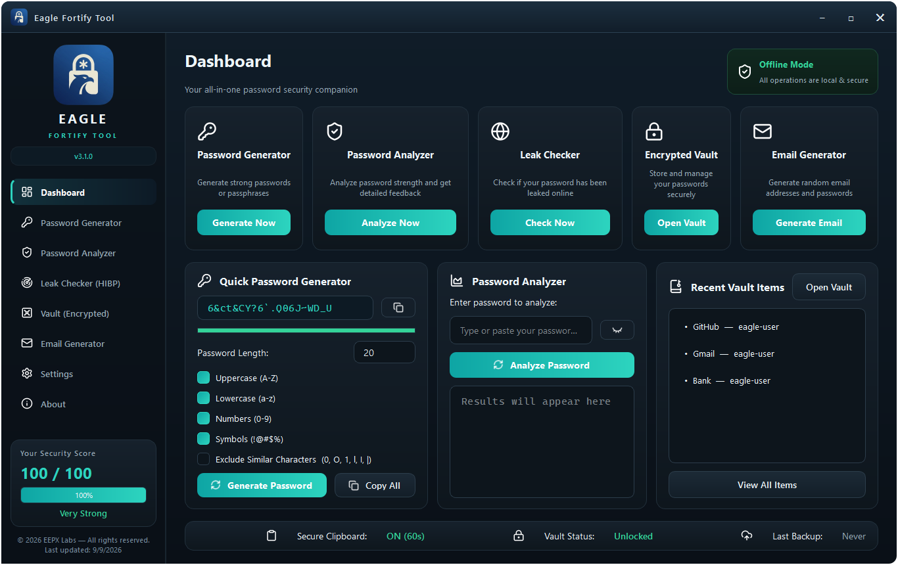
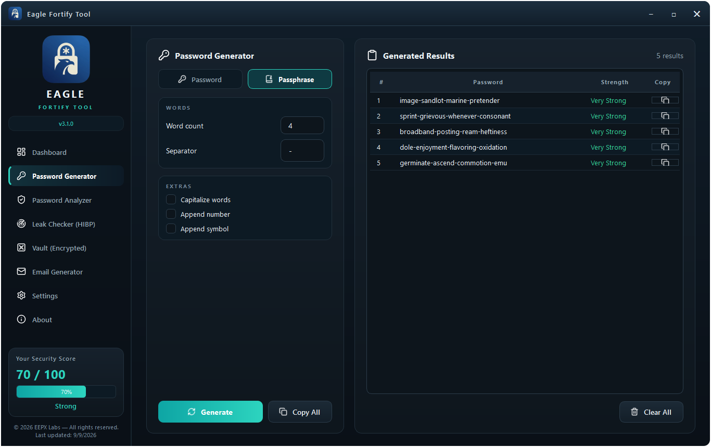
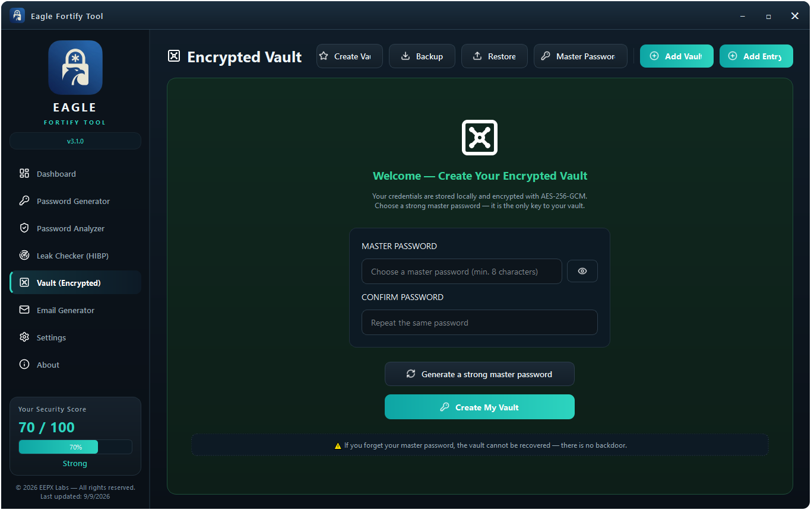
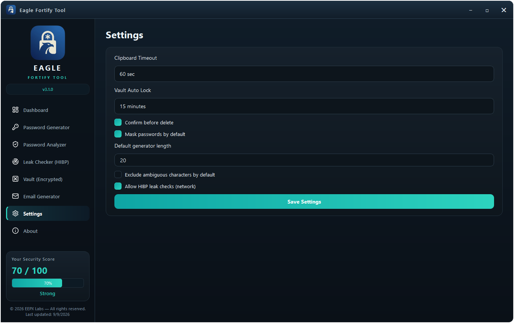
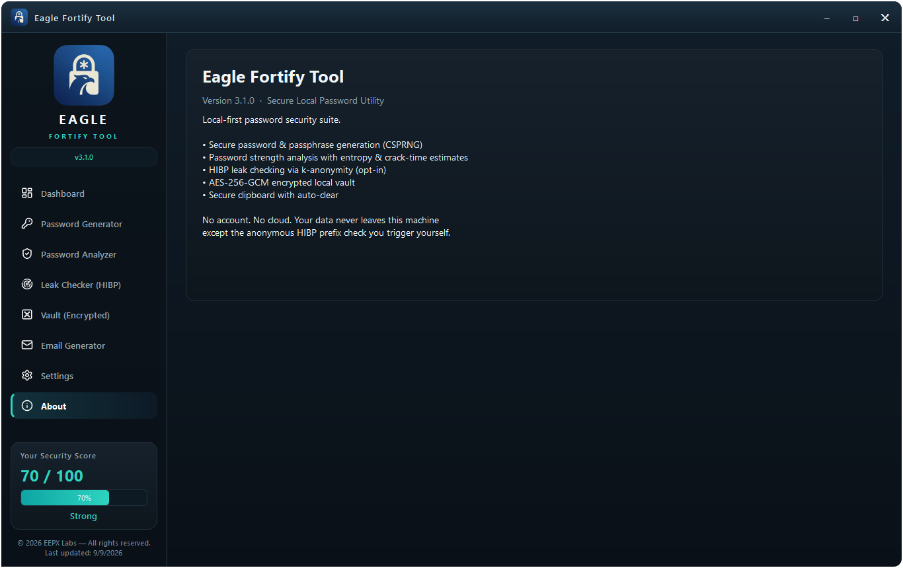

# Eagle Fortify Tool — Visual User Guide

> **Everything runs locally on your device.** The desktop app generates passwords,
> analyzes strength, creates passphrases and email identities, and stores
> credentials in an AES-256-GCM encrypted vault. The only network feature is the
> optional **Leak Checker**, which uses Have I Been Pwned k-anonymity (only the
> first 5 characters of a SHA-1 hash ever leave your PC).

All screenshots below are captured from the real app at `1366x860`.

---

## 1. Dashboard — your security home base


The Dashboard is the first screen you see. It gives you:

- **5 feature cards** with one-click shortcuts:
  `Generate Now` · `Analyze Now` · `Check Now` · `Open Vault` · `Generate Email`
- **Quick Password Generator** — set a length, pick character sets, generate and
  copy instantly without leaving the page.
- **Quick Password Analyzer** — paste any password and get an instant score.
- **Recent Vault Items** — your latest credentials once the vault is unlocked.
- **Offline Mode badge** — confirms all operations are local and secure.
- **Status bar** (bottom) — Secure Clipboard state, Vault status, Last Backup.
- **Security Score** (sidebar) — `70 / 100 - Strong` by default; it climbs to
  `100 / 100 - Very Strong` once your vault exists and is unlocked (see below).



> With the vault unlocked, the score reaches **100 / 100 - Very Strong** and
> Recent Vault Items shows your entries (GitHub, Gmail, Bank in this demo).

---

## 2. Password Generator — Password mode


**What it does:** creates cryptographically secure random passwords using a
CSPRNG (`secrets` module) with at least one character guaranteed from every
selected set.

**How to use it:**

| Control | What it does |
|---|---|
| `Password / Passphrase` tabs | Switch between random passwords and memorable passphrases |
| `Length` slider (4-128) | How long each password is — 20 is a great default |
| `Uppercase (A-Z)` / `Lowercase (a-z)` / `Numbers (0-9)` / `Symbols (!@#..)` | Character sets to draw from |
| `Exclude ambiguous (0, O, 1, l, I, \|)` | Removes look-alike characters for easier typing |
| `How many (1-10)` | Batch size — generate 5 at once and pick your favorite |
| `Generate` | Create a fresh batch |
| `Copy All` / per-row copy buttons | Copy one or all passwords (clipboard auto-clears) |
| Strength column | Every result is scored live (`Very Strong` above) |
| `Clear All` | Wipe results from the screen |

> Tip: generated passwords are **never stored or sent anywhere** — copy the one
> you want into your vault or your login form.

---

## 3. Password Generator — Passphrase mode



**What it does:** builds memorable XKCD-style passphrases from a large local
wordlist (7000+ words), e.g. `ether-cascade-chef-carded`.

**Controls:**

| Control | What it does |
|---|---|
| `Word count (3-10)` | More words = stronger (5 words shown above) |
| `Separator` | Character between words (`-`, `_`, `.`, ..) |
| `Capitalize words` | `Ether-Cascade-Chef-Carded` |
| `Append number` | Adds a random 4-digit suffix |
| `Append symbol` | Adds a trailing `!@#$%&*` symbol |

Passphrases are ideal for master passwords and Wi-Fi keys — strong yet typable.

---

## 4. Password Analyzer


---

## 6. Encrypted Vault — first run (locked)



**What it does:** stores your credentials in a file encrypted with
**AES-256-GCM**. The encryption key is derived from your Master Password with
**PBKDF2-HMAC-SHA256 (600,000 iterations)** and a random 32-byte salt.

**Creating your vault:**

1. Choose a **Master Password** (min. 8 characters — longer is better).
2. Repeat it in **Confirm Password**.
3. Click **Generate a strong master password** if you need inspiration.
4. Click **Create My Vault**.

> **Zero-knowledge:** your Master Password never leaves your machine and is
> stored nowhere. If you forget it, **the vault cannot be recovered — not even
> by the developer.** There is no backdoor.

---

## 7. Encrypted Vault — unlocked


**What you get once unlocked:**

| Control | What it does |
|---|---|
| `Lock` | Instantly re-locks and wipes keys from memory |
| `Backup` | Save an encrypted backup copy (still AES-256-GCM) |
| `Restore` | Load a vault from a backup file |
| `Master Password` | Change your master password (re-wraps the data key) |
| `Add Entry` | Store a new credential (title, username, email, password, website, notes, tags) |
| `Search` | Instant in-memory search over title, username, email, website, tags |
| Entry list | `GitHub`, `Gmail`, `Bank` in this demo — **double-click to edit**, **right-click to copy/delete** |

Credentials auto-lock after inactivity (configurable in Settings), and every
save is **atomic** (write-temp, fsync, replace) with tamper-evident GCM tags:
any modified byte makes decryption fail completely.

---

## 8. Email Generator


**What it does:** suggests random, plausible addresses for testing, sign-ups, or
aliases — **nothing is registered with any provider**.

**Controls:**

| Control | What it does |

---

## 9. Settings



All preferences are stored locally in `%USERPROFILE%/.eagle_fortify/settings.json`
— never alongside vault secrets.

| Setting | Meaning |
|---|---|
| `Clipboard Timeout` | Auto-clear copied secrets after 30 / 60 / 120 sec, or `Never` |
| `Vault Auto Lock` | Re-lock after 5 / 10 / 15 / 30 min of inactivity, or `Never` |
| `Confirm before delete` | Ask before removing a vault entry |
| `Mask passwords by default` | Show dots until you reveal a field |
| `Default generator length` | Starting length for the Password Generator |
| `Exclude ambiguous characters by default` | Skip `0 O 1 l I \|` in new passwords |
| `Allow HIBP leak checks (network)` | Master switch for the only online feature |

Click **Save Settings** — changes apply immediately (clipboard timer, auto-lock,
generator defaults).

---

## 10. About



A quick reference card: app version, feature summary, and the privacy promise —
**no account, no cloud, your data never leaves this machine** except the
anonymous HIBP prefix check you trigger yourself.

---

## Command-line companion (`eftool`)

Prefer the terminal? The same engine ships as `eftool`:

```bat
eftool --version
eftool generate --length 24 --count 3
eftool analyze "your-password-here"
eftool passphrase --words 5
eftool email
eftool vault create
eftool vault list
```

## Re-capturing these screenshots

The images above are generated from the live app (demo vault only — your real
vault is never touched):

```bat
python tools\capture_screenshots.py
```

Output goes to `docs/screenshots/*.png` at `1366x860`.

---

*Copyright 2026 EEPX Labs — All rights reserved. Screenshots captured from Eagle
Fortify Tool v3.1.0 with demo data.*

|---|---|
| `Prefix (optional)` | Base name, e.g. `eagle-user` |
| `Domain` | `gmail.com`, `outlook.com`, `yahoo.com`, `icloud.com`, `proton.me`, or any custom domain |
| `Password length (8-64)` | A strong companion password is generated for each identity |
| `High randomness` | Longer random suffix for harder-to-guess addresses |
| `Generate Email` / `Copy All` | Create a batch of 5 identities, copy them all at once |

Each row is an `address | password` pair ready to paste into a registration form
and save in your vault.


**What it does:** scores any password **entirely offline** — nothing is uploaded.
The demo password `Eagle-Demo-2026!Secure` scores `100 / 100 - Very Strong`.

**Metrics explained:**

| Metric | Meaning |
|---|---|
| `Entropy (144.5 bits)` | Mathematical randomness — higher is harder to guess |
| `Score (100 / 100)` | 0-100 composite of entropy, length, and diversity |
| `Strength (Very Strong)` | `Very Weak < Weak < Moderate < Strong < Very Strong` |
| `Charset Size (95)` | Distinct characters the password draws from |
| `Crack Time` | Offline-GPU estimate (documented approximation) |

**Security Checklist** verifies 8 rules at a glance: length >= 12, uppercase,
lowercase, number, symbol, not commonly leaked, no predictable sequence, no
heavy repetition. Click the **eye button** to reveal/hide the password.

---

## 5. Leak Checker (HIBP)


**What it does:** checks whether a password appears in known data breaches via
the **Have I Been Pwned** API using **k-anonymity**:

1. The app hashes your password with SHA-1 **locally**.
2. Only the **first 5 characters** of that hash are sent to HIBP.
3. HIBP returns candidate suffixes; matching happens **on your PC**.
4. Your password is **never transmitted, stored, or logged**.

> Only check passwords you **no longer use**. The app runs the check in a
> background thread so the UI never freezes, and you can disable network checks
> entirely in Settings (`Allow HIBP leak checks`).
